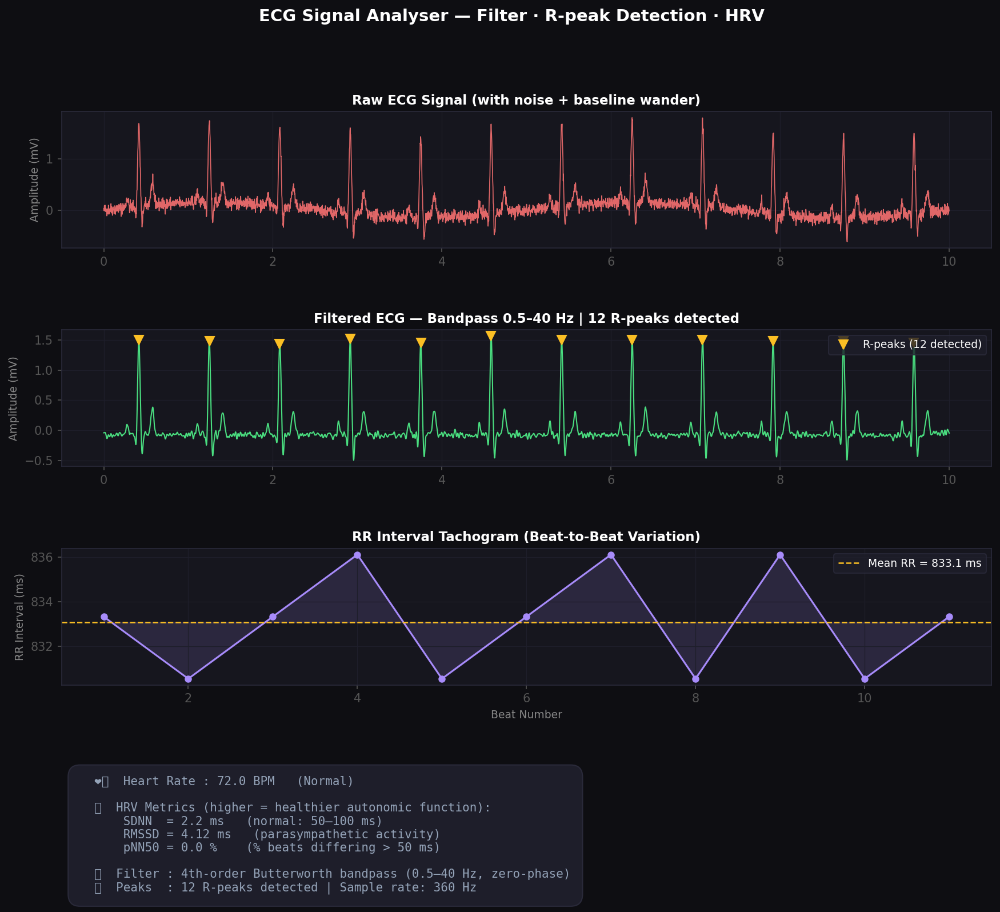

# 💓 ECG Signal Analyser

A Python tool that takes a noisy ECG signal, applies clinical-grade filtering, detects heartbeats, and computes Heart Rate + HRV metrics — built using real biomedical signal processing techniques from ECE coursework.

---

## 📸 Demo



---

## ✨ What it does

| Stage | What happens | ECE concept |
|---|---|---|
| Signal generation | Synthetic ECG using Gaussian wave model | P, Q, R, S, T wave anatomy |
| Filtering | 4th-order Butterworth bandpass (0.5–40 Hz) | IIR filter design, Nyquist theorem |
| Peak detection | R-peak detection with distance + height constraints | Threshold-based signal analysis |
| Heart Rate | Computed from mean RR interval | Frequency from time-domain signal |
| HRV | SDNN, RMSSD, pNN50 | Statistical signal analysis |

---

## 🧠 The Signal Processing

### Why bandpass 0.5–40 Hz?
```
< 0.5 Hz  → baseline wander (patient breathing)   ← remove
0.5–40 Hz → actual ECG information                 ← keep
> 40 Hz   → muscle noise, powerline (50 Hz India)  ← remove
```

### Butterworth filter (zero-phase)
```python
# filtfilt() = forward pass + backward pass
# Result: zero phase distortion → accurate R-peak timing
b, a = butter(4, [0.5/180, 40/180], btype='band')
ecg_filtered = filtfilt(b, a, ecg_noisy)
```

### HRV Metrics
```
SDNN  = std(RR intervals)              # overall variability
RMSSD = sqrt(mean(diff(RR)²))         # parasympathetic activity
pNN50 = % pairs with |ΔRR| > 50 ms   # vagal tone marker
```

---

## 🚀 How to Run

```bash
git clone https://github.com/Vibha-13/ecg-signal-analyser
cd ecg-signal-analyser

pip install -r requirements.txt

python3 ecg_analyser.py
```

### Use real ECG data (MIT-BIH PhysioNet)
```python
# In ecg_analyser.py, replace generate_ecg_signal() with:
import wfdb
record = wfdb.rdrecord('mitdb/100', sampto=3600)
ecg_noisy = record.p_signal[:, 0]
SAMPLE_RATE = record.fs  # 360 Hz
```

---

## 🏗 Architecture

```
ecg_generator.py          ecg_analyser.py
──────────────────         ──────────────────────────────────
Gaussian wave model   →   Bandpass filter (Butterworth)
P, Q, R, S, T waves       R-peak detection (find_peaks)
+ AWGN noise          →   Heart Rate (60 / mean RR)
+ Baseline wander         HRV: SDNN, RMSSD, pNN50
                      →   4-panel matplotlib plot
```

---

## 🛠 Tech Stack

**Python · NumPy · SciPy · Matplotlib**

---

## 🔮 Future Improvements

- [ ] Real MIT-BIH dataset integration via `wfdb`
- [ ] Atrial fibrillation (AF) detection from irregular RR intervals
- [ ] Frequency-domain HRV (LF/HF ratio via FFT)
- [ ] Streamlit UI — upload your own ECG CSV

---

## 🔗 Connection to Wellness Companion

The `ece_logs` table in my [AI Wellness Companion](https://github.com/Vibha-13/ai-wellness-companion) stores `filtered_hr` and `gsr_stress`. This project is the signal processing engine behind that feature — implementing the actual ECG pipeline it was designed to use.

---
## 🎯 Why This Project Stands Out

- Implements clinical ECG preprocessing (bandpass filtering)
- Detects heartbeats using signal-based peak detection
- Computes HRV — used in stress and cardiac analysis
- Demonstrates full pipeline: signal → processing → insight

> Similar to how real ECG monitoring systems process physiological signals.

## 👩‍💻 Author

**Vibha** · ECE @ NMIT Bengaluru  
[LinkedIn](https://linkedin.com/in/yourprofile) · [GitHub](https://github.com/Vibha-13)

> *Built from Biomedical Signal Processing + DSP coursework. The same filtering and peak detection pipeline used in hospital-grade ECG monitors.*
